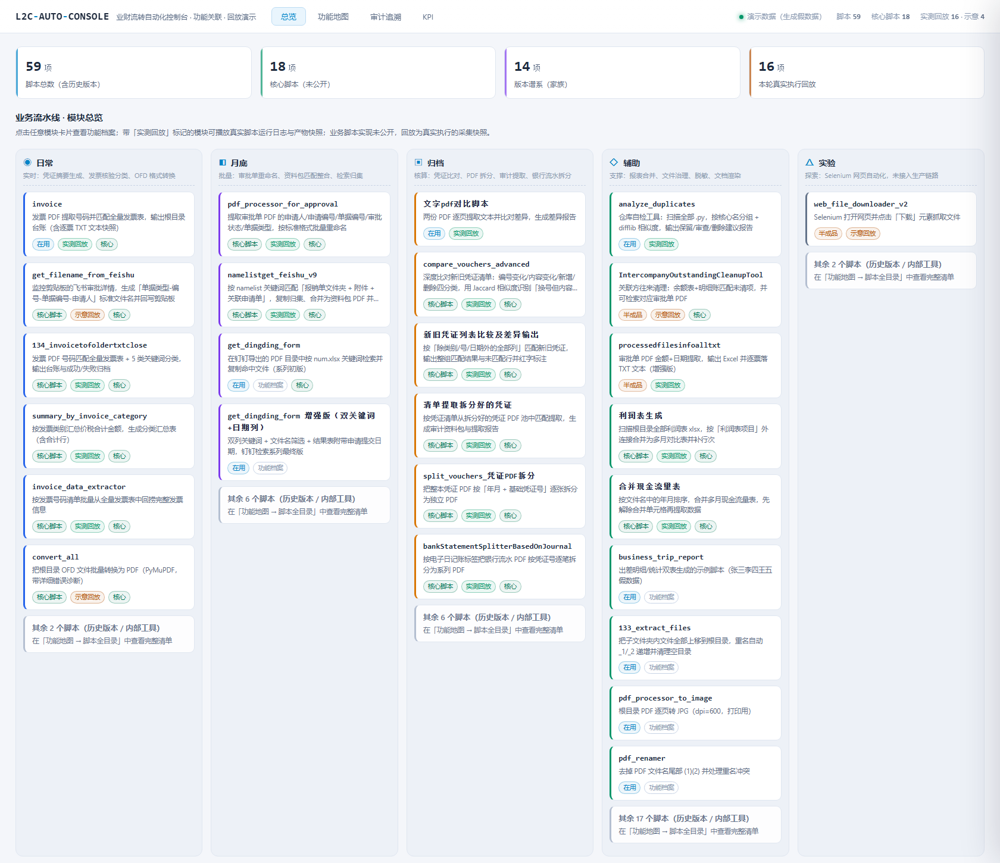
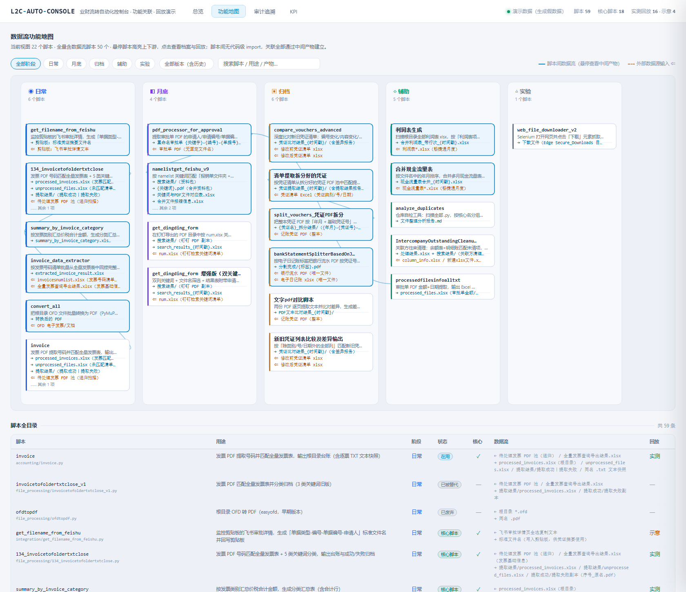
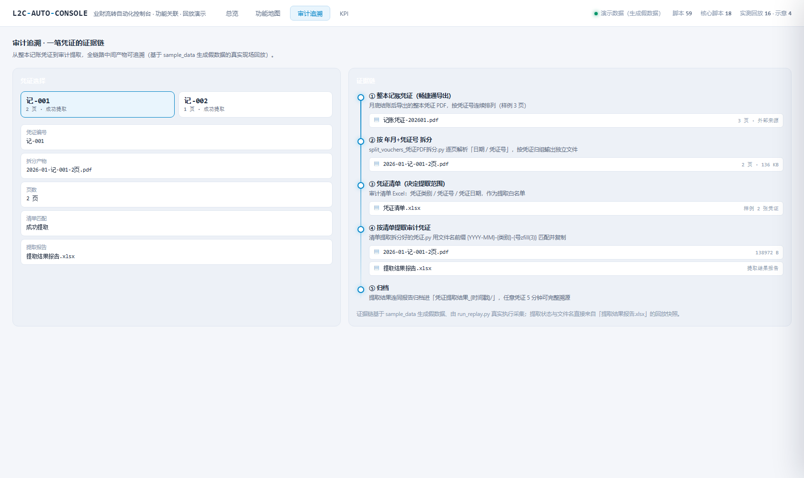

# 业财流转自动化控制台 (L2C-Auto-Console)
## 零断点打通「业务审批-财务核算-单项目 ROI」的实战工具箱

[](https://github.com/AXIRYYYY/L2C-Auto-Console/actions/workflows/quality.yml?query=branch%3Amain)

> 把财务规则前置到审批前端（事前预算卡控），把商机与回款数据打通（实时 ROI），
> 让「业务审批 → 财务核算 → 数据归档 → 审计溯源」全程自动化——月结从 3 天压缩到 4 小时。

> **📌 公开范围**：本仓库公开 **① 演示层**（零依赖单文件控制台：功能地图 + 真实执行回放 + 审计追溯 + KPI）
> 与 **② 4 个代码样本**（完整可运行、带集成测试，见「四、代码样本」）。
> 其余业务脚本实现未公开；所有回放均来自真实执行采集的产物快照，基于生成的脱敏假数据。



---

## 一、30 秒上手

| 步骤 | 说明 |
| ---- | ---- |
| 1 | 打开 `docs/demo/console.html`（双击即可：零依赖、无外链、断网可用） |
| 2 | 「总览」看五个阶段的模块全景，点卡片查看功能档案与运行回放 |
| 3 | 「功能地图」看 59 个脚本的数据流关联与 14 组版本谱系 |
| 4 | 「审计追溯」看一笔凭证从整本 PDF 到审计提取的完整证据链 |
| 5 | 「KPI」看效能指标（页面已标注口径与推算过程） |
| 6 | 想看代码？直接跳「[四、代码样本](#四代码样本可验证)」：4 个脚本 + 测试可直接运行 |

## 二、功能地图：一套自动化体系是怎么连起来的



**这张图回答的问题**：堆了 59 个脚本的自动化体系，内部到底是怎么协作的？

- 脚本之间**没有代码级 import**，关联全部通过**中间产物**建立（Excel 命名约定、文件名前缀、凭证号格式）
- 因此地图不是调用树，而是「脚本 ↔ 中间产物 ↔ 业务阶段」的**数据流二部图**
- 覆盖五个阶段：日常（实时）/ 月底（批量）/ 归档（核算）/ 辅助（支撑）/ 实验（探索）
- 14 组版本谱系展示每个工具从早期版本到当前版的演进，**含半成品/被替代/废弃的真实状态**，不做美化

## 三、审计追溯：一笔凭证的证据链



以凭证「记-001」为例：

```
整本记账凭证 PDF（3 页）→ 按 年月+凭证号 拆分（2 页 + 1 页）→ 清单匹配 → 提取结果报告（成功提取 ×2）
```

每一步都留下可追溯的中间产物。审计场景下，任意一笔支出可在 5 分钟内完整还原
「谁审批 → 有没有预算 → 凭证编号是多少 → PDF 在哪里」。

## 四、代码样本（可验证）

公开层不止是「观看器」——以下 4 个脚本**完整公开、可直接运行、带集成测试**，覆盖算法、流水线、解析与防御式设计：

| 脚本 | 展示的能力 |
| ---- | ---------- |
| [`compare_vouchers_advanced.py`](accounting/compare_vouchers_advanced.py) | 内容签名（frozenset 集合）+ Jaccard 相似度，四分类差异与「附单据数」审计高亮 |
| [`namelistget_feishu_v9.py`](integration/namelistget_feishu_v9.py) | 多阶段流水线：扫描 → 归集 → 关联 → 合并 → 对账；缺件降级与错误报告 |
| [`split_vouchers_凭证PDF拆分.py`](accounting/split_vouchers_凭证PDF拆分.py) | 全角/半角正则解析 + 按（年月, 凭证号）分组、带页数命名输出 |
| [`bankStatementSplitterBasedOnJournal.py`](accounting/bankStatementSplitterBasedOnJournal.py) | 防御式设计：唯一文件约束 + 行/页数一致性校验，拒绝文件错配 |

每个脚本头部写明用途 / 输入 / 输出 / 用法 / 依赖，并标注对应的回放文件——**代码与回放可互相印证**。
带弹窗的脚本支持命令行参数：**不带参数仍然弹窗**，向后兼容。

```bash
# 无头运行示例（先用 sample_data 生成样例数据）
python sample_data/generate_sample_data.py
python accounting/compare_vouchers_advanced.py sample_data/归档/凭证清单_修改前.xlsx sample_data/归档/凭证清单_修改后.xlsx
python accounting/split_vouchers_凭证PDF拆分.py sample_data/归档/记账凭证-202601.pdf
python integration/namelistget_feishu_v9.py sample_data/月底/申请单 sample_data/月底/附件
```

运行测试（4 个脚本的无头集成断言 + 敏感扫描器规则 + 清单一致性）：

```bash
pip install -r requirements-dev.txt
python -m pytest docs/demo/tests -q
```

## 五、怎么读这个 Demo（诚实声明）

| 标记 | 含义 |
| ---- | ---- |
| **实测回放**（16 条） | 在隔离工作区用 `sample_data/` 假数据**真实执行**脚本，采集日志与产物快照 |
| **示意回放**（4 条） | 依赖剪贴板 / 浏览器等无法无头执行的环境，按代码逻辑生成，已在页面明确标注 |
| 数据 | 全部为生成假数据（见 `sample_data/`），零真实业务信息 |

> 设计原则：宁可如实标注「示意」，也不把演示包装成「全都能跑」。

## 六、协作与边界声明

为了让评审者清楚「哪些是谁做的」，把边界写在这里：

| 范围 | 归属 |
| ---- | ---- |
| 业务背景、流程设计、字段与口径约定、数据来源 | 本人（受雇期间的真实业务系统；对外展示数据全部脱敏或重新生成） |
| 全部业务脚本（含本页公开的 4 个代码样本） | 本人于任职期间编写；公开前仅补充 docstring、命令行入口与依赖修正，**核心逻辑未改动** |
| 演示层（控制台页面、回放采集管线、功能地图、敏感扫描器、CI 配置、本 README） | 由 AI 辅助构建与重构；需求、取舍、验收与脱敏审查由本人负责 |
| 回放数据（`docs/demo/replay/*.json`） | 真实执行采集的产物快照；本机绝对路径已在采集时替换为 `<工作区>` |

**没有做的事**：没有为了让演示好看而伪造运行结果——无法无头执行的脚本一律如实标注「示意回放」（共 4 条）。

## 七、已知工程债与演进方向

这套工具诞生于「业务优先、快速交付」的现实约束，工程上并不完美。主动列出主要债务与演进计划：

| 工程债 | 现状 | 演进方向 |
| ------ | ---- | -------- |
| 脚本间「暗契约」 | 靠文件名前缀 / Excel 列位约定串联，换人接手容易断 | 抽出中间产物 manifest（字段与命名注册表），入口处加 schema 校验 |
| 缺少自动化测试 | 关键路径原先无测试（本仓库已为公开样本补上集成测试作为第一步） | 以样例数据为夹具补齐各脚本契约测试，纳入 CI |
| 交互式入口 | 历史脚本依赖弹窗，不适合批处理与 CI | 新增命令行入口（公开的 4 个样本已完成），逐步统一为 `--input/--output` |
| 数据接入方式 | 剪贴板抓取 + 本地文件解析，依赖页面结构稳定 | 已规划飞书/钉钉开放 API 直连，彻底解耦 |
| 版本并存 | 存在 v1/v2 历史版本（见功能地图的版本谱系） | 收敛为单一实现 + 兼容层，清理已被替代版本 |

> 这些不是包装话术：功能地图把每个脚本的真实状态（半成品 / 已被替代 / 废弃）都标注出来了。

## 八、它解决什么业务问题

### 8.1 典型中小企业的业财断层

业务数据产生在飞书审批，财务核算依赖畅捷通，两套系统之间没有自动化的数据通道。
财务人员每天手动下载审批单、逐条录入凭证、人工核对发票——月结期每家公司至少 3 天，且平均每期出现 3-5 笔因预算超支导致的返工。

### 8.2 四大痛点与对应方案

| 痛点 | 传统方式 | 平台方案 |
| ---- | -------- | -------- |
| **资金流失** | 预算缺乏前置卡控，超支事后才发现 | 预算事前卡控：审批发起时自动查询项目剩余预算，不足则拒绝或转财务特批 |
| **商机漏单** | 签了多少、回了多少，月底才知道 | O2C 链路打通：商机 → 合同 → 回款三端比对，逾期自动预警 |
| **成本黑箱** | 只有月底利润表，无法拆到单项目/客户 | 变动成本穿透到项目/客户/合同维度，实时 ROI 可查 |
| **审计风险** | 凭证 PDF 散落、编号混乱，追溯困难 | 凭证拆分归档 + 新旧编号对照，任意凭证 5 分钟完整溯源 |

### 8.3 效能指标（业务口径 · 未独立复核）

| 指标 | 优化前 | 优化后 | 变化 | 依据 |
| ---- | ------ | ------ | ---- | ---- |
| 单张凭证处理 | 约 8 分钟 | 约 30 秒 | -94% | 推算 ① |
| 发票核对与分类 | 约 3 小时/批次 | 约 10 分钟/批次 | -94% | 推算 ② |
| 月结周期 | 3 个工作日 | 4 小时 | -94% | 汇总项 |
| 审计凭证提取 | 约 2 天 | 约 5 分钟 | -99% | 口径说明 |
| PDF 拆分重命名 | 约 1 天 | 约 2 分钟 | -99% | 口径说明 |

**推算过程**

- **① 单张凭证 8 分钟 → 30 秒**：人工链路 = 打开审批单 → 抄摘要 → 查科目/成本中心 → 录入借贷分录 → 核对金额 → 提交，约 6~8 个动作合计约 8 分钟；自动化后人工只剩「核对自动生成的草稿」，约 30 秒。
- **② 发票核对 3 小时/批次 → 10 分钟**：以 120 张/批次估算，人工逐张打开、抄号码、与台账比对约 90 秒/张；自动化后批量提交 + 程序匹配，人工只处理未匹配项（样例中 5 张有 1 张未匹配）。

「汇总项」指月结周期由上述单项改善叠加而来；「口径说明」未做逐项拆解，仅记录计时方式（程序化提取 vs 人工翻找 / 批量脚本 vs 手工另存）。

> ⚠️ 以上均为**业务口径的估算与推算，未经独立复核**，不构成实测基准；控制台 KPI 页同步标注与展示推算过程。

## 九、公开内容与重建

### 9.1 目录结构

```
L2C-Auto-Console/
├── .github/workflows/quality.yml  # 质量门：敏感扫描 / 清单一致性 / 构建可复现 / 测试
├── accounting/                    # 代码样本
│   ├── compare_vouchers_advanced.py
│   ├── split_vouchers_凭证PDF拆分.py
│   └── bankStatementSplitterBasedOnJournal.py
├── integration/
│   └── namelistget_feishu_v9.py   # 代码样本：月底资料包整合
├── docs/
│   ├── FUNCTION_MAP.md           # 功能地图文档（59 脚本档案 + 14 组版本谱系）
│   ├── function_map.json         # 机器可读档案（控制台的数据源）
│   ├── SENSITIVE_SCAN_REPORT.md  # 公开前敏感信息审查报告
│   └── demo/
│       ├── console.html          # ★ 单文件控制台（主要交付物）
│       ├── console.template.html # 控制台模板（含构建注入点）
│       ├── build_console.py      # 构建：数据注入 → console.html + FUNCTION_MAP.md
│       ├── run_replay.py         # 回放采集：隔离工作区真实执行脚本
│       ├── sensitive_check.py    # 公开文件敏感扫描器（可复跑）
│       ├── public_files.txt      # 公开文件清单（唯一事实源）
│       ├── _harness/             # GUI 拦截执行器（tkinter / input / startfile）
│       ├── tests/                # 公开层测试（扫描器规则 + 清单一致性 + 脚本集成）
│       ├── replay/               # 回放采集结果（20 条，已脱敏）
│       └── assets/               # README 截图
├── requirements-dev.txt          # 公开层开发/测试依赖（CI 使用）
└── sample_data/                  # 生成假数据（生成器 + 数据契约说明）
```

### 9.2 重建回放（三步）

```bash
python sample_data/generate_sample_data.py   # 1. 生成假数据
python docs/demo/run_replay.py               # 2. 真实执行脚本并采集（约 2 分钟）
python docs/demo/build_console.py            # 3. 重建 console.html 与 FUNCTION_MAP.md
```

> - 第 2 步需要全部业务脚本（仅 4 个样本公开）与 `requirements.txt` 依赖（Python 3.10+）
> - 仅重建页面可直接执行第 3 步：回放数据已随仓库提供，`build_console.py` 只用标准库
> - 只想验证公开的 4 个脚本：见「四、代码样本」，用 `requirements-dev.txt` 即可

### 9.3 敏感信息审查

- 发布前对全部公开文件执行「自动扫描 + 人工复核 + 真实信息反向交叉排查」，结论见
  [`SENSITIVE_SCAN_REPORT.md`](docs/SENSITIVE_SCAN_REPORT.md)
- 可随时复跑审查：`python docs/demo/sensitive_check.py`
- CI 已把该扫描设为硬门（任何硬违规直接失败），见 `.github/workflows/quality.yml`

## 十、技术栈

| 层级 | 技术选型 | 说明 |
| ---- | -------- | ---- |
| 语言 | Python 3.10+ | 核心数据处理与自动化 |
| 表格处理 | openpyxl, pandas, xlsxwriter | Excel 读写、报表生成、多月合并 |
| PDF 处理 | PyMuPDF (fitz), pdfplumber, pypdf | 文本提取、页面拆分、命名重排 |
| 电子发票 | PyMuPDF（OFD→PDF），pdfplumber（核验） | 格式转换与发票信息核对 |
| 集成 | 剪贴板抓取 + 本地文件处理 | 审批数据接入（规划 API 直连解耦） |
| 自动化 | Selenium（实验性，未接入生产链路） | 网页端自动化探索 |
| 演示 | 原生 HTML/CSS/JS 单文件（零依赖） | 控制台页面与回放展示 |
| 质量 | pytest + GitHub Actions（windows-latest） | 敏感扫描 / 清单一致性 / 构建可复现 / 集成测试 |

## 十一、独立性与可运行声明

- 演示页面零依赖：单文件、无外链、断网可用（仅需浏览器）
- 回放与样例数据均为纯本地文件处理，不依赖任何外部 API 或内网服务
- 所有展示数据为生成假数据；4 个代码样本完整公开可运行，其余业务脚本实现未公开
- 公开文件清单、敏感审查记录与质量门配置随仓库提供，审查与构建过程均可复现

## 十二、许可

[MIT License](LICENSE)
